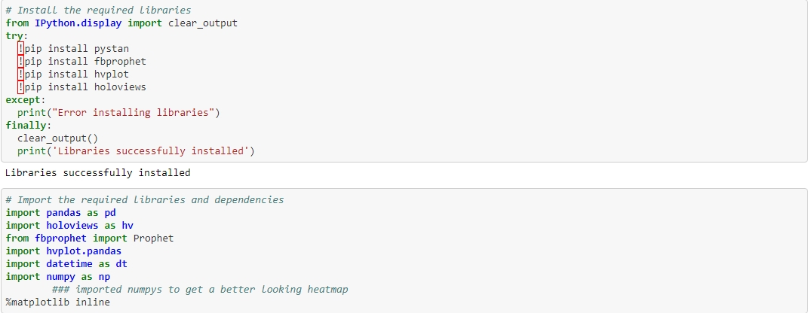
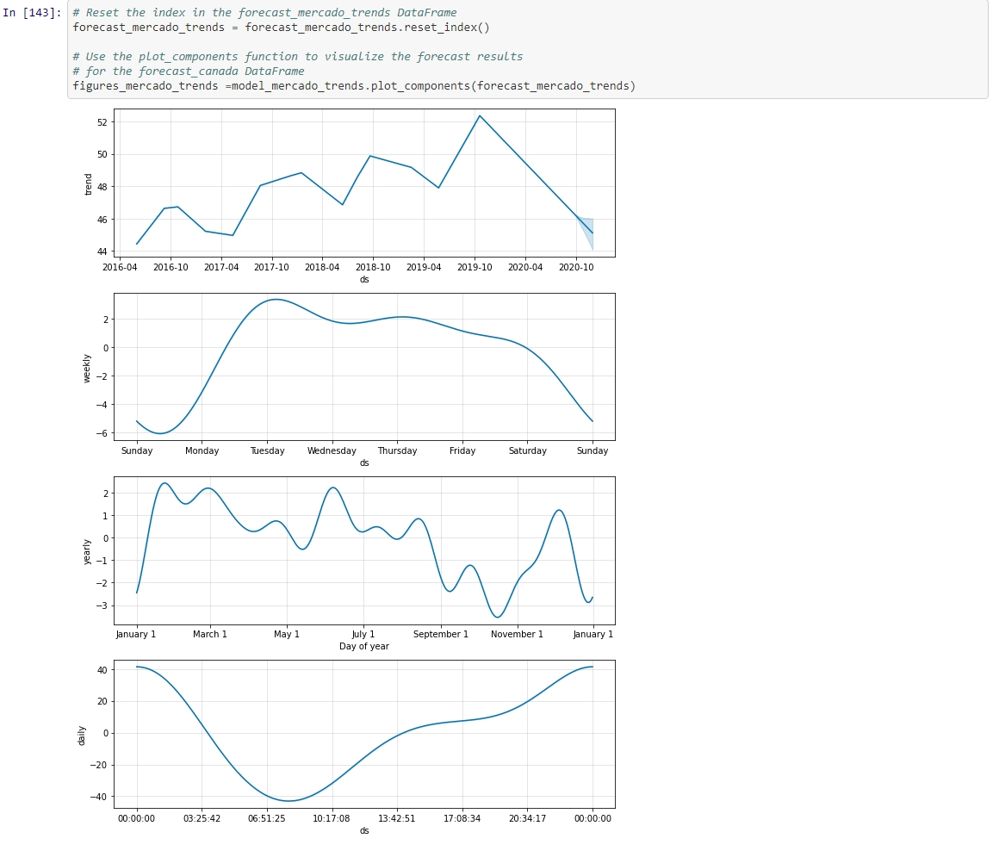
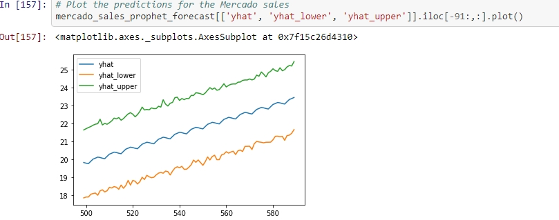

# Challenge-11

Crypto Clusters 

Our goal was to analyze the company's financial and user data in clever ways to make the company grow.

Step 1: Find unusual patterns in hourly Google search traffic

Step 2: Mine the search traffic data for seasonality

Step 3: Relate the search traffic to stock price patterns

Step 4: Create a time series model with Prophet

Step 5 (optional): Forecast revenue by using time series models


---

## Technologies
This application is written in Python 3.7 using Google Collab 

this application uses the following packages:
 
pandas
pyviz hvplot
fbprophet 
numpy 

---

## Installation Guide

Before running the application first install the following dependencies.
See the associated Screenshot for what to Install 

 


---

## Examples

Please see the following images of the code and resulting graphs 





---

## Usage

To use the data simply clone the repository.

Different K values can be looked at to see if the clusters are more useful. Just because 4 is the most efficent it may not be the best.

Charts could also be changed to make things look different  
```
---

## Contributors

Sean Patel (myself) seanpatel076@gmail.com
---

## License

License is public anyone can use or make changes to this application
